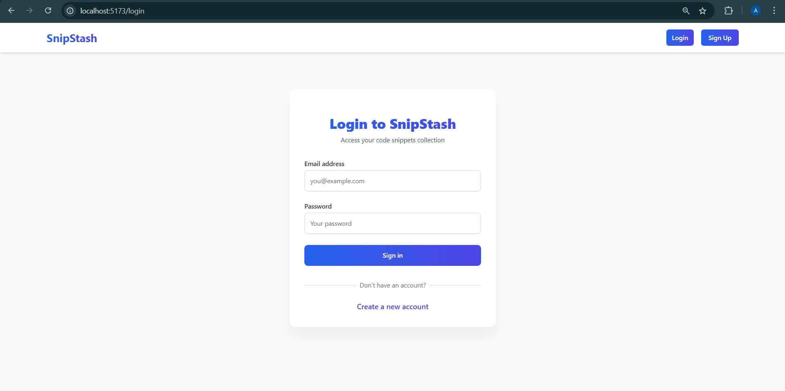
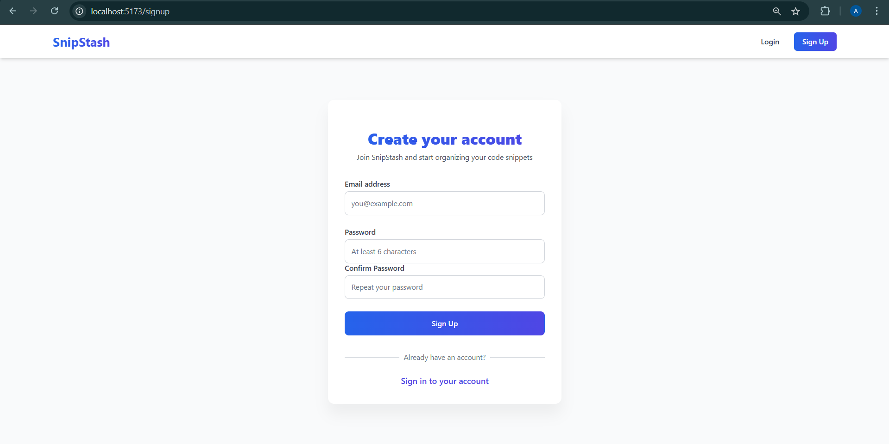
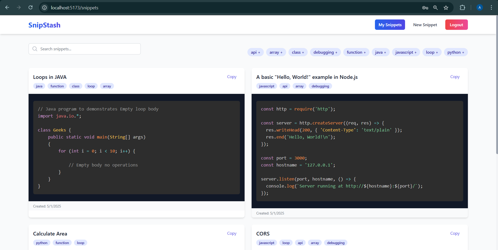
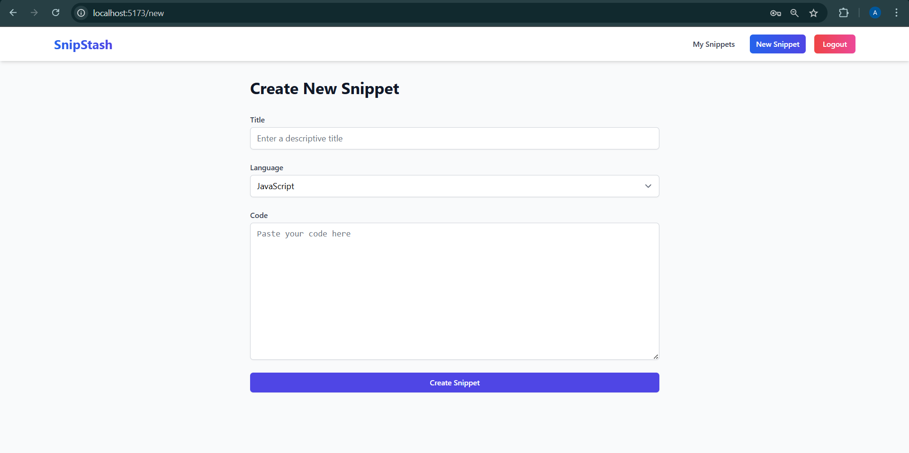

# SnipStash

SnipStash is a modern web application for organizing, storing, and managing code snippets. Built with React, Express, and MongoDB, it provides a seamless experience for developers to save and access their useful code snippets.

## Screenshots

<div align="center">
  
  
  <br /><br />
  
  
</div>

## Features

- **User Authentication**: Secure signup and login functionality
- **Snippet Management**: Create, read, update, and delete code snippets
- **Syntax Highlighting**: Beautiful code highlighting with Prism.js
- **Responsive Design**: Works on desktop and mobile devices
- **Modern UI**: Clean and intuitive user interface with TailwindCSS

## Table of Contents

- [Installation](#installation)
  - [Prerequisites](#prerequisites)
  - [Backend Setup](#backend-setup)
  - [Frontend Setup](#frontend-setup)
- [Usage](#usage)
- [API Documentation](#api-documentation)
- [Technologies Used](#technologies-used)
- [Deployment](#deployment)
- [Contributing](#contributing)
- [License](#license)

## Installation

### Prerequisites

- Node.js (v14 or newer)
- MongoDB (local or Atlas)
- npm or yarn

### Backend Setup

1. Clone the repository:
   ```bash
   git clone https://github.com/ashmita41/SnipStash.git
   cd SnipStash
   ```

2. Create a `.env` file in the server directory:
   ```
   PORT=5000
   MONGODB_URI=mongodb://localhost:27017/snipstash
   JWT_SECRET=your-super-secret-jwt-key
   JWT_EXPIRE=24h
   ```

3. Install dependencies and start the server:
   ```bash
   cd server
   npm install
   npm run dev
   ```

### Frontend Setup

1. Install dependencies and start the client:
   ```bash
   cd client
   npm install
   npm run dev
   ```

2. The application will be available at `http://localhost:5173`

## Usage

1. Register a new account or login with existing credentials
2. Create new snippets with code, description, and language
3. Browse, search, and filter your code snippets
4. Edit or delete existing snippets as needed

## API Documentation

### Authentication Endpoints

- **POST /api/auth/signup**: Register a new user
- **POST /api/auth/login**: Authenticate a user
- **GET /api/auth/me**: Get the current user's profile

### Snippet Endpoints

- **GET /api/snippets**: Get all snippets for the logged-in user
- **POST /api/snippets**: Create a new snippet
- **GET /api/snippets/:id**: Get a specific snippet
- **PUT /api/snippets/:id**: Update a snippet
- **DELETE /api/snippets/:id**: Delete a snippet

## Technologies Used

### Frontend
- React
- TypeScript
- TailwindCSS
- Axios
- React Router
- Prism.js

### Backend
- Node.js
- Express
- MongoDB
- Mongoose
- JWT Authentication
- bcrypt.js

## Deployment

### GitHub Deployment Guide

1. **Initialize Git Repository** (if not already done):
   ```bash
   git init
   ```

2. **Add All Files to Git**:
   ```bash
   git add .
   ```

3. **Commit Your Changes**:
   ```bash
   git commit -m "Initial commit: SnipStash application"
   ```

4. **Link to GitHub Repository**:
   ```bash
   git remote add origin https://github.com/ashmita41/SnipStash.git
   ```

5. **Push Your Code**:
   ```bash
   git push -u origin master
   ```

### Production Deployment Considerations

1. **Environment Variables**: Ensure all sensitive information is stored in environment variables
2. **Database**: Set up a production MongoDB database
3. **CORS**: Configure CORS for your production domain
4. **Error Handling**: Implement comprehensive error handling
5. **Security**: Review security best practices before deployment

## Contributing

Contributions are welcome! Please feel free to submit a Pull Request.

1. Fork the repository
2. Create your feature branch (`git checkout -b feature/amazing-feature`)
3. Commit your changes (`git commit -m 'Add some amazing feature'`)
4. Push to the branch (`git push origin feature/amazing-feature`)
5. Open a Pull Request

## License

This project is licensed under the MIT License - see the LICENSE file for details.

---

Created by [Ashmita Pandey](https://github.com/ashmita41) 